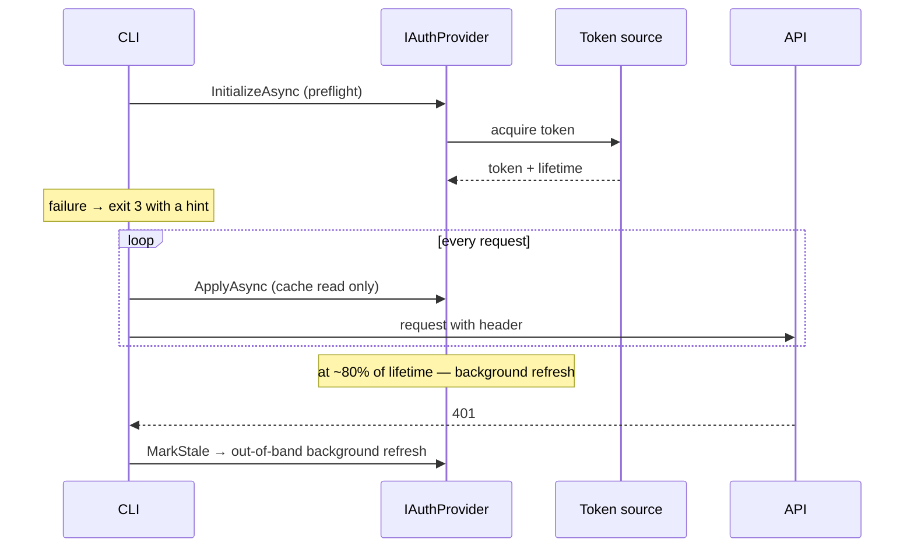

# Auth

> Status: draft. Adding a type: skill `adding-auth-provider`.
> User instructions: `docs/user/GETTING_STARTED.md`.

## Purpose

Nothing needs to change in the API under test. LoadKit behaves like a regular client (Postman, a frontend)
and attaches the same headers to requests. The module's job:
1. acquire a token **before** the load starts;
2. keep it fresh during the run;
3. apply it to every request at no time cost, so metrics are not distorted.

## Files

`src/LoadKit.Core/Auth/`: `IAuthProvider`, `TokenAuthProviderBase`, `AuthHandler`, `AuthRequestOptions`,
`AuthProviderFactory`, `SecretMasker`, `Providers/*`.
Auth options are records in `Scenarios/Model/` (`BearerAuth`, `ApiKeyAuth`, ...), described in
`Scenarios/Validation/ScenarioFormat.cs` and bound by `ScenarioBinder`.

## Contracts

```csharp
public interface IAuthProvider : IDisposable                                                 // Dispose stops refresh
{
    Task InitializeAsync(CancellationToken cancellationToken);                              // preflight
    ValueTask ApplyAsync(HttpRequestMessage request, CancellationToken cancellationToken);  // hot path
    void MarkStale();                                                                        // after 401
}

public abstract class TokenAuthProviderBase : IAuthProvider
{
    protected abstract Task<AccessTokenResult> AcquireTokenAsync(CancellationToken cancellationToken);
    // cache, background refresh at ~80% of lifetime, SemaphoreSlim, retry on refresh failure
}

public readonly record struct AccessTokenResult(string Token, DateTimeOffset? ExpiresAt);
```

Pipeline:

```
HttpClient → AuthHandler (DelegatingHandler) → SocketsHttpHandler → network
```

Requests with `"auth": false` are marked via `HttpRequestMessage.Options`, and `AuthHandler` skips them.

## Types

| `type` | How it gets the token | Lifetime | Secret | Local check |
|---|---|---|---|---|
| `bearer` | ready value from `${env:}` | not tracked | `${env:}` | TargetApi `/secure` |
| `apiKey` | ready value, in a header or query | not tracked | `${env:}` | TargetApi `/secure` |
| `login` | request to your own endpoint, token via JSONPath | `expiresInPath` or JWT `exp` | `${env:}` | TargetApi `/auth/login` |
| `oauth2ClientCredentials` | POST to `tokenUrl` (client credentials) | `expires_in` | `${env:}` | TargetApi `/oauth2/token` |
| `azureIdentity` | `AzureCliCredential` (default) or `DefaultAzureCredential` | from the token | none | fake `TokenCredential` in tests |

### Fields

- `bearer`: `token`; optional `header` (default `Authorization`) and `format`
  (default `Bearer {token}`).
- `apiKey`: `value` and exactly one of `header` / `query`. `header` is recommended: a value in the query
  ends up in the URL, and the URL is written to server logs and telemetry.
- `login`: `request` (like a `requests[]` item, path relative to `baseUrl`), `tokenPath`,
  optional `expiresInPath`, `header`, `format`.
- `oauth2ClientCredentials`: `tokenUrl`, `clientId`, `clientSecret`, `scope`.
- `azureIdentity`: `scope`, optional `source`: `azureCli` (default) or `default`.

## Flow



1. `AuthProviderFactory` creates a provider from `auth.type`. Login and token requests use a separate
   `HttpClient` without `AuthHandler` (`HttpPipelineFactory.CreateUnauthenticated`).
2. Preflight (`Engine/PreflightChecker`, shared by `check` and `run`): first `baseUrl` must answer with any
   HTTP status, then `InitializeAsync` acquires the first token. Providers throw `AuthException` with a message and a
   hint; any failure → exit 3 with a "what to check" line.
3. During the run, `ApplyAsync` reads the token from a field (volatile read), without network calls.
4. Background refresh is a timer at ~80% of lifetime (via `TimeProvider`), at least 1 s and at most 1 day ahead
   (timers cannot wait longer). A token without a known lifetime is never refreshed by the timer.
5. A 401 response → `MarkStale()` → out-of-band background refresh, at most once every 5 seconds.
   The request itself is not retried: retries distort metrics.
6. Refreshes are serialized (`SemaphoreSlim`), and each one carries the token generation it saw: if the token
   was already replaced, it does nothing. So a timer and 50 concurrent 401s still acquire one token.
7. A failed background refresh keeps the old token, retries after 5 s, and is reported after the run.
8. Every acquired token is added to `SecretMasker` (`AddSecret`).
9. `bearer` and `apiKey` cannot refresh: for them `MarkStale` only increments a counter,
   and the summary hints "token or key may be expired or wrong — update the variable".

Lifetime sources: `login` — `expiresInPath` (seconds), else the JWT `exp` claim; `oauth2ClientCredentials` —
`expires_in`, else JWT `exp`; `azureIdentity` — `AccessToken.ExpiresOn`. Neither known → non-expiring, `check` warns.

## Security

- `SecretMasker` masks the `Authorization`, `Proxy-Authorization`, `Cookie`, `Set-Cookie`, `x-functions-key`,
  `api-key`, `x-api-key` headers and the custom `auth.header`; the credential values of `auth.*` (token, key,
  client secret, every login request value) and of sensitive headers in `headers`, both as is and URL-encoded
  (this covers the `apiKey.query` value in URLs). Values shorter than 4 characters are not masked.
  Masking applies to the console, reports and logs.
- `check` shows the server response, but not the secrets sent.
- A secret written directly in JSON is a `secret-literal` validation error (checked before env substitution).

## Edge cases and common errors

- **Bearer expired during the run** — 401s grow and a hint to update the variable is shown.
- **JWT without `exp` and without `expiresInPath`** — the token is treated as non-expiring, with a warning in `check`.
- **`azureIdentity` without `az login`** — exit 3 with the `az login` command.
- **`azureIdentity`: consent error AADSTS65001** for the "Microsoft Azure CLI" application.
  By default, an API in Entra ID does not allow Azure CLI to get tokens for it. The owner of the API's app registration
  must add Azure CLI (client id `04b07795-8ddb-461a-bbee-02f9e1bf7b46`) to "Authorized client
  applications" under Expose an API. The LoadKit error message includes this hint.
- **`oauth2ClientCredentials` gets a token, but the API returns 401/403** — the token was issued to an application, not
  a user (roles instead of scopes). The API must accept app-only tokens with the required role.
- **`scope`** for your own API is `api://<application-id-uri>/.default`.

## TargetApi test endpoints

- `/secure` accepts: a static dev token from configuration, an API key in `x-api-key`, and tokens
  issued by `/auth/login` and `/oauth2/token`. Otherwise 401.
- `/auth/login` and `/oauth2/token` issue tokens with a configurable lifetime (10 seconds by default),
  so refresh tests take seconds.
