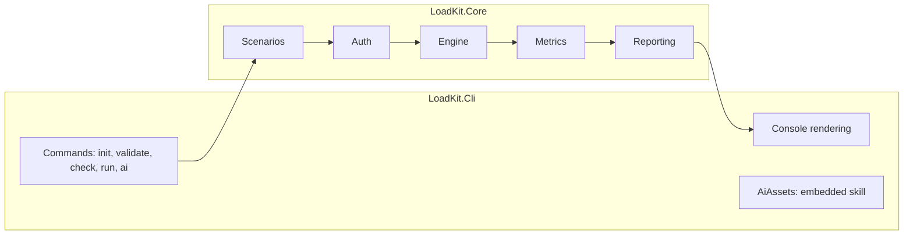
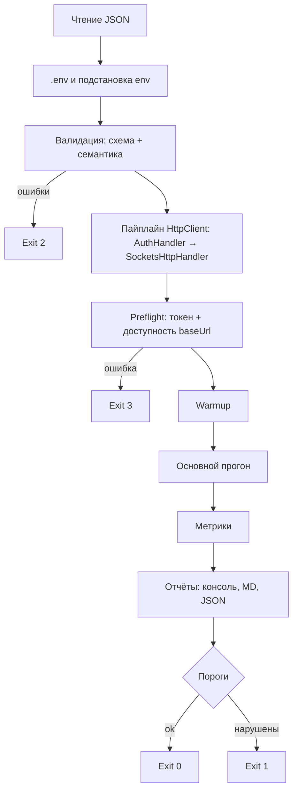

# Обзор архитектуры

> Статус: draft

## Назначение

LoadKit — консольный `dotnet tool` для локального нагрузочного тестирования HTTP API.
Нагрузка описывается JSON-сценарием; инструмент валидирует его, получает токены, отправляет запросы,
считает перцентили и формирует отчёт. Сценарии могут писать AI-ассистенты через навык `loadtest`.

## Принципы

1. Сценарий — данные, а не код.
2. Честные метрики: в замер попадает только HTTP-запрос.
3. Секреты не лежат в файлах сценария и не попадают в отчёты.
4. Ошибка видна до старта нагрузки (`validate`, `check`).
5. Расширение одним классом: auth-тип, формат отчёта, шаблон.
6. Core не зависит от оболочки: Cli сегодня, Desktop — возможно завтра (ADR-002).

## Компоненты



| Компонент | Документ |
|---|---|
| Scenarios | `SCENARIOS.md` |
| Auth | `AUTH.md` |
| Engine, Metrics | `ENGINE.md` |
| Reporting, CLI | `REPORTING_AND_CLI.md` |
| Навык для AI | `AI_INTEGRATION.md` |

## Поток `loadtest run`



## Структура решения

```
src/LoadKit.Core/
  Scenarios/   Model/, ScenarioLoader, EnvFileLoader, TemplateCompiler, ScenarioValidator
  Auth/        IAuthProvider, TokenAuthProviderBase, AuthHandler, AuthProviderFactory, Providers/, SecretMasker
  Engine/      LoadRunner, WeightedRequestPicker, RequestFactory, HttpPipelineFactory
  Metrics/     RequestResult, ResultCollector, PercentileCalculator, ThresholdEvaluator
  Reporting/   RunReport, MarkdownReportWriter, JsonReportWriter
src/LoadKit.Cli/
  Commands/    InitCommand, ValidateCommand, CheckCommand, RunCommand, AiInstallCommand, AiStatusCommand
  Rendering/   ProgressRenderer, SummaryRenderer, ValidationRenderer
  AiAssets/    копия ai/skills/loadtest (embedded resources)
samples/TargetApi, samples/scenarios
schemas/scenario.schema.json
```

## Ограничения v1

Нет: распределённой нагрузки, цепочек запросов с передачей данных, открытой модели (фиксированный RPS),
стадий разгона, протоколов кроме HTTP. Кандидаты v2 — в `docs/PLAN.md`.
