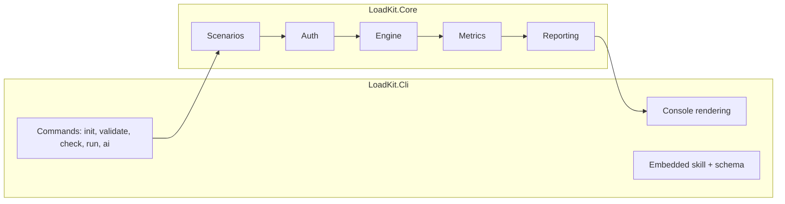
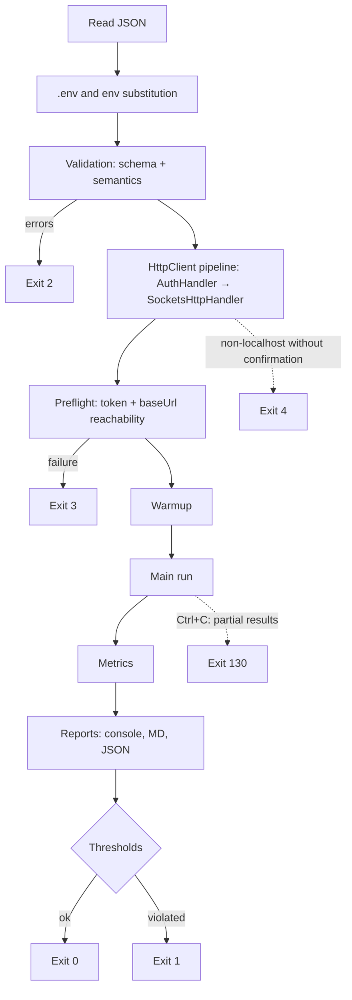

# Architecture overview

> Status: draft

## Purpose

LoadKit is a console `dotnet tool` for local load testing of HTTP APIs.
Load is described by a JSON scenario; the tool validates it, acquires tokens, sends requests,
calculates percentiles and produces a report. Scenarios can be written by AI assistants via the `loadtest` skill.

## Principles

1. A scenario is data, not code.
2. Honest metrics: only the HTTP request is measured.
3. Secrets do not live in scenario files and never end up in reports.
4. Errors are visible before the load starts (`validate`, `check`).
5. Extension with a single class: auth type, report format, template.
6. Core does not depend on the shell: Cli today, possibly Desktop tomorrow (ADR-002).

## Components



| Component | Document |
|---|---|
| Scenarios | `SCENARIOS.md` |
| Auth | `AUTH.md` |
| Engine, Metrics | `ENGINE.md` |
| Reporting, CLI | `REPORTING_AND_CLI.md` |
| AI skill | `AI_INTEGRATION.md` |

## `loadtest run` flow



## Solution structure

```
src/LoadKit.Core/
  Scenarios/   ScenarioLoader, EnvFileLoader, ScenarioValidator (own, no library), ScenarioCompiler,
               Model/, Validation/ (format spec + rules), Templates/ (TemplateCompiler, generators),
               Scaffolding/ (init: ScenarioScaffolder, WorkspaceInitializer)
  Auth/        IAuthProvider, TokenAuthProviderBase, AuthHandler, AuthProviderFactory, Providers/, SecretMasker
  Engine/      LoadRunner (+ LoadRun, one run's state), WeightedRequestPicker, RequestFactory, HttpPipelineFactory,
               PreflightChecker (baseUrl + first token), ScenarioChecker (check: one request per entry)
  Metrics/     RequestResult, ResultCollector, PercentileCalculator, RunStatisticsCalculator, HistogramBuilder,
               ThresholdEvaluator
  Reporting/   RunReport, RunReportBuilder (warnings, KQL), MarkdownReportWriter, JsonReportWriter, ReportFileWriter
src/LoadKit.Cli/
  Commands/    InitCommand, ValidateCommand, CheckCommand, RunCommand, AiInstallCommand, AiStatusCommand
  Rendering/   ConsoleFactory (plain output when redirected), ProgressTaskReporter, RunSummaryRenderer, ValidationRenderer
  (csproj)     embeds schemas/scenario.schema.json (and, from phase 5, ai/skills/loadtest/**) by link, without a copy
samples/TargetApi, samples/scenarios
schemas/scenario.schema.json, schemas/report.schema.json
```

## v1 limitations

Not included: distributed load, request chains passing data between steps, open model (fixed RPS),
ramp-up stages, protocols other than HTTP. v2 candidates are in `docs/PLAN.md`.
